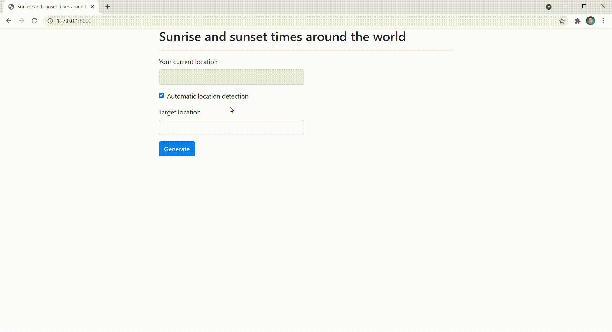

# Sunrise and sunset times around the world

## 1.3.4.2: Option 2 - Create an App for Sunrise and Sunset

Master Skills:

- Automate the conversion of time to the local time zone (no user input)
- Find an open API that will return coordinates for a user entered zip code
- Build a web interface that users access to interact with the application

---

Written with Django. Command to run `python manage.py runserver`

## Used free APIs

- [developer.mapquest.com](https://developer.mapquest.com/) 
- [abstractapi.com](https://www.abstractapi.com/)
- [sunrise-sunset.org](https://sunrise-sunset.org/api)