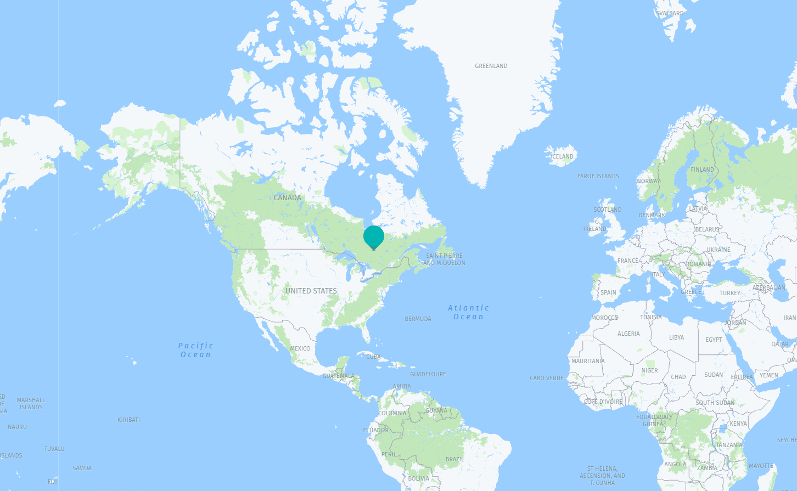

# Web app that shows a map of the current location of ISS

## 1.3.4.3: Option 3 - Create an App for the ISS

Master Skills:

- Build a web app that shows a map of the current location of ISS.

---

Written with Flask. Command to run `python run.py`

## Used free APIs

- Open APIs From Space: [open-notify.org](http://open-notify.org/)
- Location for developers: [developer.here.com](https://developer.here.com/) 
